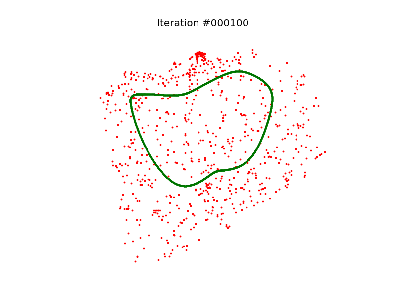

# Self-Organizing Maps for Travelling Salesman Problem

## Introduction

Self-organizing maps (SOM) or Kohonen maps are a type of artificial neural network (ANN) that mixes in an interesting way the concepts of competitive and cooperative neural networks. A SOM behaves as a typical competitive ANN, where the neurons fight for a case. The interesting twist added by Kohonen is that **when a neurons wins a case, the prize is shared with its neighbors**. Typically, the neighborhood is bigger at the beginning of the training, and it shrinks in order to let the system converge to a solution.

## Applying SOM to TSP

One of the most interesting applications of this technique is applying it to the [Travelling Salesman Problem](https://en.wikipedia.org/wiki/Travelling_salesman_problem), in which we can use a coordinate map and trace a route using the neurons in the ANN. By defining weight vectors as positions in the map, we can iterate the cities and treat each one as a case that can be won by a single neuron. The neuron that wins the case gets it weight vector updated to be closer to the city, but also its neighbors get updated. The neurons are placed in a 2D space, but they are only aware of a single dimension in their internal ANN, so their behavior is like an elastic ring that will eventually fit all the cities in the shortest distance possible.

The method will rarely find the optimal route among the cities, and it is quite sensitive to changing the parameters, but it usually lays more than acceptable results taking into account the time consumed.

In the repository you can find the source code to execute it (in Python 3) as well as the necessary maps in the `assets/` folder (already trimmed to be used in the code). The maps used have been extracted from the TSP page in [University of Waterloo](http://www.math.uwaterloo.ca/tsp/world/countries.html). There is also a `diagrams/` folder that contains all the execution snapshots that had to be included in the report (present as well as a `.tex` file).

---

The code present in this repository was delivered as Project 3 in the [IT3105 Artificial Intelligence Programming](https://www.ntnu.edu/studies/courses/IT3105/2016/1) course in the Norwegian University of Science and Technology the course 2016-2017. The code was developed by [Leonard Kleinhans](https://github.com/leo-labs) and [Diego Vicente](https://github.com/DiegoVicen). The code is licensed under MIT License.
